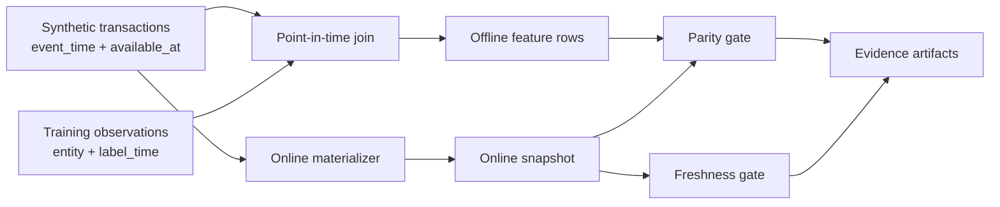

# Point-in-Time Feature Store


A deterministic reference implementation of leakage-safe historical feature
generation, online materialization, offline/online parity, and freshness checks.

> [!IMPORTANT]
> This is a **synthetic portfolio demonstration**, not a production feature
> store. Transactions, customers, labels, timestamps, and metrics are
> intentionally fictional. It demonstrates engineering semantics and runnable
> code, not production scale or business outcomes.

## Why point-in-time correctness matters

Training data must contain only facts that were knowable at label time. This
demo models two clocks for every transaction:

- `event_time`: when the business event occurred;
- `available_at`: when the pipeline could actually consume it.

A feature row at time `T` includes a transaction only when:

```text
event_time <= T AND available_at <= T
```

That second condition prevents late-arriving records from leaking future
knowledge into historical training sets. The synthetic fixture includes both a
future event and an event that happened earlier but arrived after label time;
tests prove that neither is included.

## Architecture



## Feature view

The checked-in [`data/feature-view.json`](data/feature-view.json) documents the
entity, clocks, version, and eight features:

| Feature | Semantics |
|---|---|
| `tx_count_24h`, `spend_usd_24h` | Completed activity in trailing 24 hours |
| `tx_count_7d`, `spend_usd_7d` | Completed activity in trailing seven days |
| `tx_count_30d`, `spend_usd_30d` | Completed activity in trailing 30 days |
| `avg_ticket_usd_30d` | Mean completed transaction amount in 30 days |
| `last_transaction_age_hours` | Age of most recent eligible transaction |

Money is aggregated with `Decimal`, ordering is stable, and outputs are
normalized before parity comparison.

## Quick start

Python 3.11+ is the only runtime requirement.

```bash
make check
make demo
```

The demo uses a fixed `as_of` time and writes:

```text
.artifacts/demo/
├── offline-features.csv
├── online-snapshot.json
├── parity-report.json
├── freshness-report.json
└── summary.json
```

Expected summary:

```json
{
  "freshness": "PASS",
  "offline_rows": 4,
  "online_entities": 4,
  "parity": "PASS",
  "status": "PASS",
  "synthetic_demo": true
}
```

## CLI

```bash
PYTHONPATH=src python3 -m feature_store demo \
  --transactions data/transactions.csv \
  --observations data/observations.csv \
  --as-of 2026-07-28T12:00:00Z \
  --output-dir .artifacts/demo
```

The `parity` and `freshness` subcommands can independently verify persisted
artifacts. Failed gates return a non-zero status for CI use.

## Correctness invariants

1. Transaction identifiers are unique.
2. Availability cannot precede event time.
3. Negative transaction amounts are rejected.
4. Only `completed` transactions contribute to features.
5. Window lower bounds are exclusive and observation times are inclusive.
6. Offline and online computation share one feature function.
7. Parity compares every feature for every requested entity.
8. Freshness rejects stale and future-dated snapshots.

## Repository map

```text
.
├── .github/workflows/ci.yml
├── data/
├── docs/
│   ├── adr-001-bitemporal-pit-join.md
│   └── runbook.md
├── src/feature_store/
└── tests/
```

See the [architecture decision](docs/adr-001-bitemporal-pit-join.md) for the
two-clock model and the [runbook](docs/runbook.md) for parity and freshness
incident response.

## Production evolution

A production system would add distributed compute, incremental backfills,
schema registry integration, an online low-latency store, historical materialization
metadata, feature ownership and access controls, skew monitoring over time,
orchestration, and warehouse-specific query generation. Those capabilities are
deliberately not implied by this compact educational implementation.
